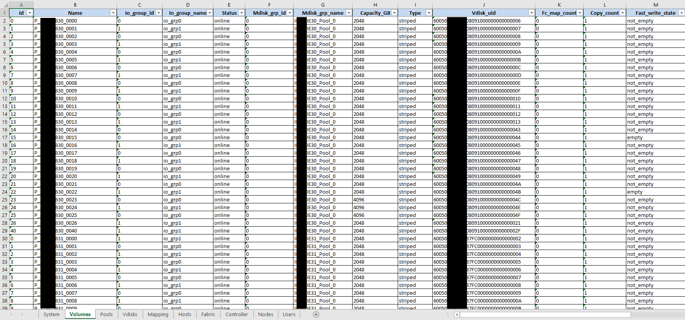

# Array-XRay

A tool to provide an inventory of your EMC VPLEX, VMAX and IBM SVC arrays

## Purpose

This tool can manage EMC VPLEX, VMAX and IBM SVC/FlashSystem arrays.

On EMC VPLEX systems you can inventory:
- All Cluster's information
- List of all initiators
- List of all volumes 
- List of all Storage Views
- List of all backend Storage arrays

On EMC VMAX systems you can inventory:
- All System's information
- List of Thin Pools (for VMAX-2 family)
- List of TDEVs
- List of SRPs (for VMAX-3 family)
- List of Initiators
- List of Masking Views
- List of Hosts
- List of Host Groups
- List of Port Groups
- List of Storage Groups
- List of FAST Policies (for VMAX-2 family)

On IBM SVC systems you can inventory: 
- List of all SVC systems
- List of all Vdisks/Volumes
- List of all Pools/Managed disks groups
- List of all Hosts
- List of all host mapping relations
- List of fabric details
- List of nodes details
- List of declared users

The inventory file generated by this tool is an excel file. New formats will 
be added as needed (especially ElasticSearch).

## Dependencies 

This tool use several module that you can find in the file requirements.txt.

## EMC VPLEX

### Usage

```
[jbrt@localhost]$ ./vplex-xray.py --help
usage: vplex-xray.py [-h] -c CONFIG -p PATH -f FILE [-d]

Vplex-XRay - Tool for Inventory a VPLEX

optional arguments:
  -h, --help            show this help message and exit
  -c CONFIG, --config CONFIG
                        config file
  -p PATH, --path PATH  path to store file
  -f FILE, --file FILE  name of the file
  -d, --debug           enable debug mode

```

### Example

```
[jbrt@locahost]$ ./vplex-xray.py --config conf.txt --path . --file VPLEX.xlsx
Initializing a Excel workbook (VPLEX.xlsx)

Inventory of VPLEX: MAQ
Beginning of data extraction VPlex(https://172.16.15.31:443/vplex)
- Extraction of clusters
- Extraction of TDEVs
- Extraction of initiators
- Extraction of masking views
- Extraction of Storage Arrays
End of data extraction VPlex(https://172.16.15.31:443/vplex)
```

### Configuration file

Here is the syntax of the configuration file needed by this tool :

```
[NAME_OF_VPLEX]
    address = IP_ADDRESS
    user = username
    password = password
``` 

You can add all the VPLEXs you need.

## EMC VMAX

For collecting data on VMAXs this tool use the REST API of UNIPSHERE for VMAX. 
**You must use version 8.x at least.**

### Usage

```
[jbrt@localhost]$ ./vmax-xray.py --help
usage: vmax-xray.py [-h] -c CONFIG -p PATH -f FILE [-d]

VMAX-XRay - Tool for Inventory a VMAX array

optional arguments:
  -h, --help            show this help message and exit
  -c CONFIG, --config CONFIG
                        config file
  -p PATH, --path PATH  path to store file
  -f FILE, --file FILE  name of the file
  -d, --debug           enable debug mode
```

### Example

```
[jbrt@locahost]$ ./vmax-xray.py --config conf.txt --path . --file VMAX.xlsx
Initializing a Excel workbook (VMAX.xlsx)

Beginning of data extraction 000298700609
- Extraction of System's information
- Extraction of Thin Pools
- Extraction of TDEVs
- Extraction of Initiators
- Extraction of Masking Views
- Extraction of Hosts
- Extraction of Host Groups
- Extraction of Port Groups
- Extraction of Storage Groups
- Extraction of FAST Policies
End of data extraction 000298700609
```

### Configuration file

Here is the syntax of the configuration file needed by this tool :

```
[YOUR_SYMMETRIX_ID]
    address = IP_ADDRESS_OF_UNISPHERE
    user = username
    password = password
``` 

You can add all the VMAXs you need.

## IBM SVC / FlashSystem

### Usage

```
[jbrt@localhost]$ ./svc-xray.py --help
usage: svc-xray.py [-h] -c CONFIG -p PATH -f FILE [-d]

SVC-XRay - Tool for Inventory a SVC/FlashSystem Array

optional arguments:
  -h, --help            show this help message and exit
  -c CONFIG, --config CONFIG
                        config file
  -p PATH, --path PATH  path to store file
  -f FILE, --file FILE  name of the file
  -d, --debug           enable debug mode

```

### Example

This example :

```
[jbrt@locahost]$ ./svc-xray.py -c ibm.txt -p . --file IBM.xlsx
Initializing a Excel workbook (IBM.xlsx)

Inventory: SVC_PRD
Beginning of data extraction SVC(172.16.2.34)
- Extraction of System's information
- Extraction of Vdisks
- Extraction of Pools
- Extraction of Managed Disks
- Extraction of Host's mapping
- Extraction of Hosts
- Extraction of Fabric
- Extraction of Controller
- Extraction of Nodes
- Extraction of Users
End of data extraction SVC(172.16.2.34)
```

Will produce this Excel file :


### Configuration file

Here is the syntax of the configuration file needed by this tool :

```
[NAME_OF_SVC]
    address = IP_ADDRESS
    user = username (SSH)
    password = password
``` 

You can add all the SVCs you need.

## TODO

There is a lot of work ahead ! This is a first release of that tool. Many
new features will come depending on the needs. Here is some of ideas :

- ~~Adding support of the VMAX arrays (merge from my project Vmax-XRay)~~ done
- Adding new inventory format (load data into ElasticSearch, for example)

Feel free to contribute if you want.